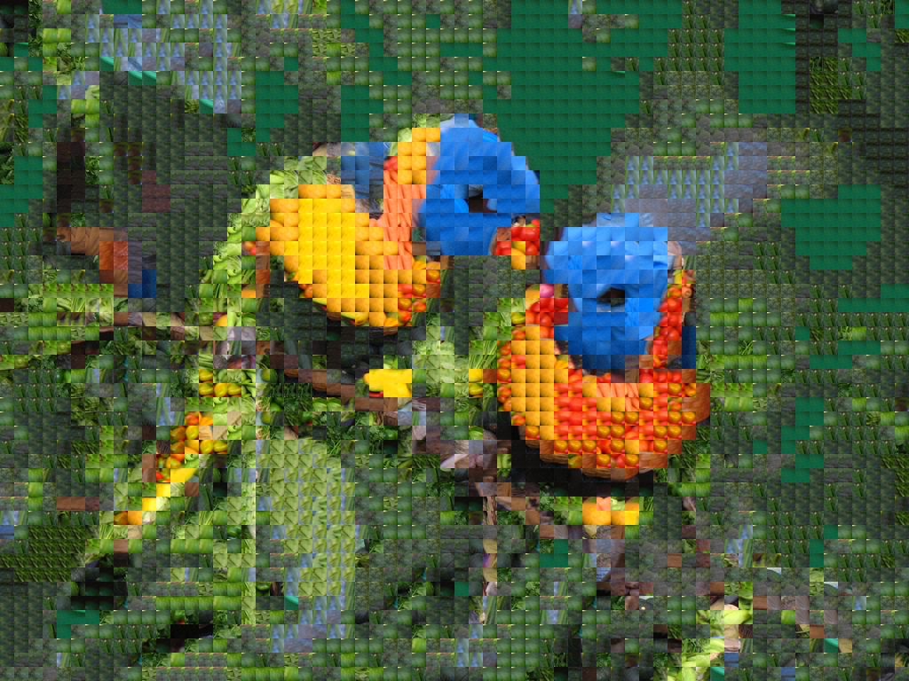

# Mosaic

Generator of a mosaic from two images. The image most similar to the first one is generated with the blocks of the second one.

## Results

    
    
    

## Performance Optimization

### SSE2 Instructions

In this project, emphasis has been placed on optimizing performance for image processing operations. A key strategy used is designing these operations to leverage SSE2 instructions, which are present in most modern processors. These instructions allow for performing mathematical and logical operations simultaneously on multiple data, known as parallel data processing. These operations are performed using a single instruction, which helps improve the performance of applications that heavily rely on mathematical calculations.

### Threads

In addition to using SSE2, threads have been used to implement the main effect that creates different parts of the mosaic in parallel.
Threads allow parallelizable parts of the code to execute simultaneously, utilizing processing resources efficiently. This accelerates the execution of the effect and improves the overall system performance.

## Dependencies

The [opencv3.0.0](https://opencv.org/releases/page/7/) library is used to work with the images.